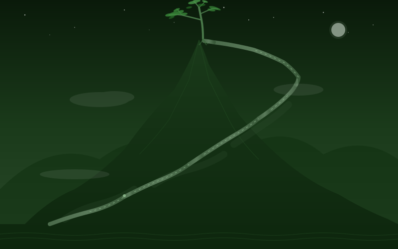

<!-- GitHub Profile README for capitalzxl -->
<!-- Design: Dark green theme, winding mountain road + welcoming pine -->

<div align="center">

# 🌄 *CapitalZXL** 🌄

<br>

<!-- SVG: Spiral winding mountain road with welcoming pine at the top -->


<br>

> *"The law of the development of things is spiraling forward."*  
> *— Each loop ascends, never returning to where it began.*

<br>

---

## 🧠 **About Me**

Cognitive Neuroscientist · AGI Researcher · Builder

PhD in Cognitive Neuroscience, now on a journey from understanding the brain to building artificial general intelligence. I believe the deepest insights about intelligence come from studying the only known general intelligence system — the biological brain — and translating those principles into machine architectures.

</div>

---

### 🔬 **What I Do**

| Area | Focus |
|------|-------|
| 🧠 **Neural Computation** | SNN, topological perception, optogenetics, neural decoding |
| 🤖 **AI Engineering** | PyTorch, Transformer architectures, model evaluation |
| 🦾 **Robotics & Embedded** | ROS2, SLAM, STM32, PCB design |
| 🔗 **BCI & Neurotech** | EEG decoding (MNE-Python), brain signal processing |

### 📈 **Current Mission**

Building the bridge between biological intelligence and AGI — one spiral at a time.

---

### 🌱 **Recent Projects**

```
📡 EEG Decoding Pipeline → MNE-Python · Time-series · Feature Extraction
🤖 ROS2 + SLAM → Navigation · Perception · Point Cloud
⚡ SNN + Transformer Study → Next-Gen Architecture Exploration
🔌 STM32 Embedded Control → C · Peripherals · PCB Optimization
```

---

<div align="center">

### 🛠️ **Tech Stack**


<br>

### 📫 **Connect**

[](mailto:jieyi12345@126.com)

<br>

---

*Built with 🟢 patience, like a mountain road — spiraling upward, always.*

</div>
